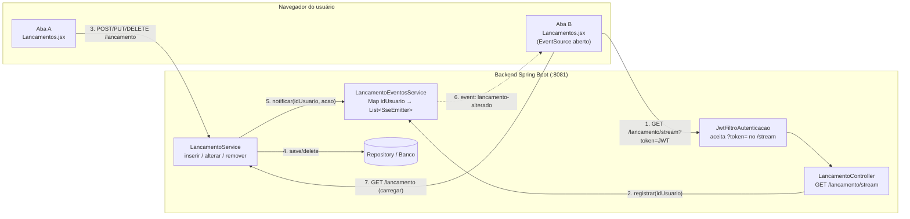
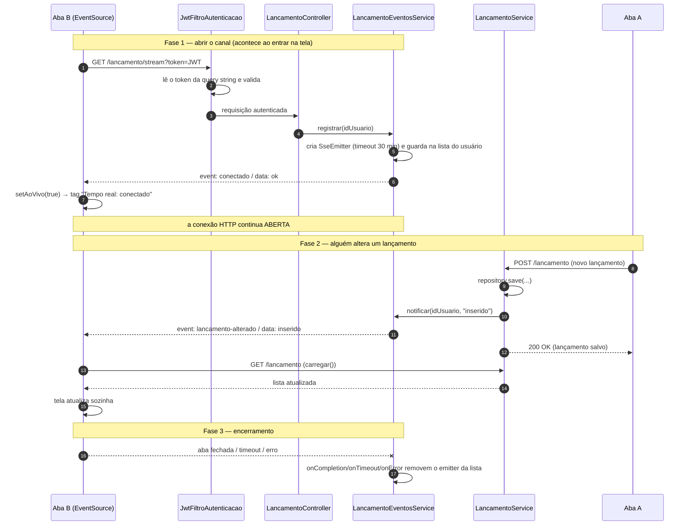

# Server-Sent Events (SSE) no financeiro26

Documento de referência: o que é SSE, como o fluxo funciona e o que foi implementado em cada arquivo.
(Para o roteiro curto de aula, veja também [sse-passo-a-passo.md](sse-passo-a-passo.md).)

---

## 1. O problema que o SSE resolve

Sem SSE, se o usuário abre a tela **Lançamentos** em duas abas e adiciona um lançamento na aba A, a aba B continua mostrando a lista antiga até alguém apertar F5.

Alternativas:

| Técnica | Como funciona | Problema |
|---|---|---|
| **Polling** | A aba B pergunta "mudou algo?" a cada N segundos | Gasta requisições à toa e ainda tem atraso |
| **WebSocket** | Canal bidirecional permanente | Mais complexo do que o necessário aqui |
| **SSE** ✅ | O servidor mantém uma resposta HTTP aberta e *empurra* eventos | Só servidor → navegador, mas é exatamente o que precisamos |

## 2. O que é SSE

- O navegador faz **uma** requisição `GET` que **não termina**.
- O servidor responde com `Content-Type: text/event-stream` e vai escrevendo eventos nessa mesma resposta, quando quiser.
- A comunicação é **unidirecional** (servidor → navegador). O sentido contrário continua sendo feito com os `POST/PUT/DELETE` normais.
- No navegador existe a API nativa **`EventSource`**, que **reconecta sozinha** se a conexão cair.
- É HTTP puro: não precisa de biblioteca nem de protocolo novo.

Formato de um evento no fio (uma linha em branco encerra o evento):

```
event: lancamento-alterado
data: inserido

```

- `event:` → nome do evento (o frontend escuta por esse nome).
- `data:` → conteúdo (aqui, a ação: `inserido`, `alterado` ou `removido`).

---

## 3. Diagrama de arquitetura



## 4. Diagrama de sequência (passo a passo no tempo)



### Versão em texto (caso o Mermaid não renderize)

```
 ABA B (EventSource)                    BACKEND                              ABA A
 -------------------                    -------                              -----
 GET /lancamento/stream?token=JWT  ──►  JwtFiltro valida token
                                        Controller.stream()
                                        EventosService.registrar(idUsuario)
 ◄── event: conectado ──────────────    (guarda o SseEmitter no Map)
 (tag "conectado", conexão ABERTA)

                                                                        POST /lancamento
                                        LancamentoService.inserir()  ◄──────────────
                                          repository.save()
                                          eventos.notificar(id,"inserido")
 ◄── event: lancamento-alterado ────      (percorre emitters do usuário)
 carregar() → GET /lancamento      ──►    devolve lista nova
 tela atualiza sozinha
```

---

## 5. O que foi implementado (arquivo por arquivo)

### 5.1 `LancamentoEventosService.java` — NOVO
[backend/src/main/java/com/ifpr/backend/service/LancamentoEventosService.java](../backend/src/main/java/com/ifpr/backend/service/LancamentoEventosService.java)

É o "gerente de conexões". Guarda quem está conectado e sabe enviar eventos.

| Elemento | Para que serve |
|---|---|
| `SseEmitter` | Representa **uma conexão aberta** (uma por aba/navegador). |
| `Map<Long, List<SseEmitter>> conexoes` | `idUsuario → conexões dele`. Um usuário com 2 abas tem 2 emitters. |
| `ConcurrentHashMap` + `CopyOnWriteArrayList` | Estruturas seguras para várias threads (requisições simultâneas) mexendo ao mesmo tempo. |
| `TIMEOUT_MS = 30 min` | Passado esse tempo a conexão é encerrada e o `EventSource` do navegador reconecta sozinho. |
| `registrar(idUsuario)` | Cria o emitter, guarda na lista, registra callbacks de limpeza e envia o evento inicial `conectado`. |
| `onCompletion / onTimeout / onError` | Removem o emitter da lista quando a aba fecha, estoura o tempo ou dá erro — **evita vazamento de memória**. |
| `notificar(idUsuario, acao)` | Percorre as conexões **só daquele usuário** e envia `lancamento-alterado`. Quem falhar é removido. |
| `enviar(...)` | `emitter.send(SseEmitter.event().name(...).data(...))`. Retorna `false` se o cliente já foi embora (`IOException`/`IllegalStateException`). |

### 5.2 `LancamentoController.java` — endpoint do stream
[backend/src/main/java/com/ifpr/backend/controller/LancamentoController.java](../backend/src/main/java/com/ifpr/backend/controller/LancamentoController.java)

```java
@GetMapping(path = "/stream", produces = MediaType.TEXT_EVENT_STREAM_VALUE)
public SseEmitter stream() {
    return eventos.registrar(authUsuarioProvider.getUsuarioAutenticado().getId());
}
```

- `produces = TEXT_EVENT_STREAM_VALUE` → responde `text/event-stream`.
- Retornar um `SseEmitter` faz o Spring **manter a resposta aberta** em vez de fechá-la.
- O id do usuário vem do `AuthUsuarioProvider` (usuário autenticado pelo JWT), então cada usuário só recebe os **próprios** eventos.

### 5.3 `LancamentoService.java` — disparar o evento
[backend/src/main/java/com/ifpr/backend/service/LancamentoService.java](../backend/src/main/java/com/ifpr/backend/service/LancamentoService.java)

Depois de gravar no banco, avisa os interessados:

| Método | Chamada | `data` enviado |
|---|---|---|
| `inserir` | `eventos.notificar(salvo.getUsuario().getId(), "inserido")` | `inserido` |
| `alterar` | `eventos.notificar(salvo.getUsuario().getId(), "alterado")` | `alterado` |
| `remover` | `eventos.notificar(lancamento.getUsuario().getId(), "removido")` | `removido` |

A notificação é feita **depois** do `save/delete`, para que, quando a outra aba recarregar a lista, o dado já esteja no banco.

### 5.4 `JwtFiltroAutenticacao.java` — autenticar o stream
[backend/src/main/java/com/ifpr/backend/security/JwtFiltroAutenticacao.java](../backend/src/main/java/com/ifpr/backend/security/JwtFiltroAutenticacao.java)

**Por quê?** O `EventSource` do navegador **não permite enviar headers customizados**, ou seja, não dá para mandar `Authorization: Bearer ...`.

**Solução (só para este endpoint):** se não veio token no header e a URL termina em `/lancamento/stream`, o filtro lê o token do parâmetro `?token=`, extrai o usuário e segue o fluxo normal de validação. Token inválido/expirado é apenas ignorado (log em `debug`), resultando em requisição não autenticada.

### 5.5 `Lancamentos.jsx` — o cliente
[frontend/src/pages/Lancamentos/Lancamentos.jsx](../frontend/src/pages/Lancamentos/Lancamentos.jsx)

```jsx
const fonte = new EventSource(`${base}/lancamento/stream?token=${usuario.token}`);

fonte.addEventListener('conectado', () => setAoVivo(true));
fonte.addEventListener('lancamento-alterado', () => carregar());
fonte.onerror = () => setAoVivo(false);

return () => fonte.close();
```

| Parte | Função |
|---|---|
| `new EventSource(url)` | Abre a conexão longa. |
| listener `conectado` | Marca o estado `aoVivo = true`. |
| listener `lancamento-alterado` | Chama `carregar()` (o mesmo `GET /lancamento` de sempre): a lista é recarregada do servidor. |
| `onerror` | Marca como desconectado; o navegador **reconecta sozinho**. |
| `return () => fonte.close()` | Cleanup do `useEffect`: fecha a conexão ao sair da tela (senão acumularia conexões). |
| Estado `aoVivo` + `<Tag>` | Indicador visual "Tempo real: conectado / desconectado" no card de saldo. |

> Nota de design: o evento **não carrega os dados**, só avisa "algo mudou". O frontend então busca a lista oficial. Isso mantém uma única fonte de verdade (o `GET /lancamento`) e reaproveita as regras de autorização já existentes.

---

## 6. Como testar

1. Subir o backend (Java 17+) e o frontend (`npm start`).
2. Logar e abrir **Lançamentos** em duas abas com o mesmo usuário → ambas mostram "Tempo real: conectado".
3. Adicionar/editar/excluir em uma aba → a outra atualiza sozinha.
4. Ver o fio: DevTools → Network → requisição `stream` → aba **EventStream**. Ou no terminal:
   ```bash
   curl -N "http://localhost:8081/lancamento/stream?token=SEU_JWT"
   ```
5. Derrubar o backend → indicador vira "desconectado"; ao subir de novo, reconecta sozinho.

## 7. Limitações conhecidas (pontos para discussão)

| Limitação | Por quê importa | Como melhorar |
|---|---|---|
| Token na URL | Aparece em logs de servidor, proxies e histórico | Cookie `HttpOnly` ou token de uso único e curta duração para o stream |
| Token não renovado | Quando expira, a reconexão automática falha | Renovar o token e recriar o `EventSource` |
| `Map` em memória | Só funciona com **1 instância** do backend | Redis Pub/Sub ou broker de mensagens |
| Sem heartbeat | Proxies/balanceadores podem derrubar conexões ociosas | Enviar comentário `:ping` periodicamente |
| Recarrega a lista inteira | Limpa a busca por descrição, se ativa | Enviar o item alterado no `data` e aplicar só o delta |
| Notificação dentro do serviço | Se houvesse transação com rollback, o evento sairia antes do commit | `@TransactionalEventListener(AFTER_COMMIT)` |
